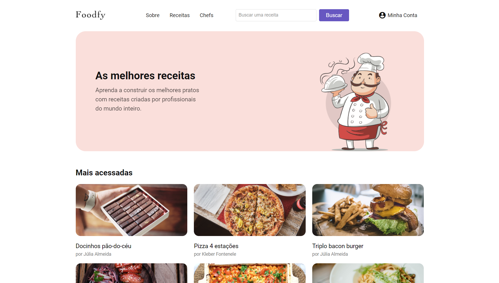

<h1 align="center">
    
</h1>

<p align="center">
  <a href="#page_facing_up-sobre">Sobre</a>&nbsp;&nbsp;&nbsp;|&nbsp;&nbsp;&nbsp;
  <a href="#computer-web">Web</a>&nbsp;&nbsp;&nbsp;|&nbsp;&nbsp;&nbsp;
  <a href="#rocket-tecnologias-utilizadas">Tecnologias Utilizadas</a>&nbsp;&nbsp;&nbsp;|&nbsp;&nbsp;&nbsp;
  <a href="#gear-como-configurar-e-executar">Como configurar e executar</a>&nbsp;&nbsp;&nbsp;|&nbsp;&nbsp;&nbsp;
</p>

<br/>

<p align="center">
  
  
  
  
  
  
  <a href="https://github.com/mausampaio/foodfy/commits/master">
    
  </a>  
</p>

<br/>

<h3 align="center">
  
</h3>

<br/>


## :page_facing_up: Sobre

O Foodfy é um portal de receitas onde o usuários tem acesso a inúmeras receitas com todos os ingredientes e detalhes de preparo. Na parte administrativa o acesso é restrito a usuários cadastrados e somente o usuário administrador pode criar novos Chefs e usuários, os demais usuários podem criar novas receitas associadas a um Chef já existente. 

Esse projeto foi desenvolvido durante a o bootcamp Launchbase, ministrado pela [Rocketseat](https://rocketseat.com.br/).

<br/>

## :computer: Web

<h3 align="center">
  
</h3>

<br/>

## :rocket: Tecnologias Utilizadas

- [Node.js](https://nodejs.org/en)

<br/>

## :gear: Como configurar e executar

### Pré-requisitos

  - É **necessário** possuir o **[Node.js](https://nodejs.org/en/)** instalado na máquina.
  - Também, é **preciso** ter um gerenciador de pacotes seja o **[NPM](https://www.npmjs.com/)** ou **[Yarn](https://yarnpkg.com/)**.
  - Por fim, é essencial ter o **[PostgreSQL](https://www.postgresql.org/)** instalado.

```bash

    # Clonar o repositório
    $ git clone https://github.com/mausampaio/foodfy.git 'foodfy'

    # Navegar para o diretório
    $ cd foodfy

```
#### Database

- É necessário criar a sua base de dados juntamente com todas as tabelas necessárias, para facilitar criei um arquivo na raiz do projeto com nome de database.pgsql que contem todas as informações necessárias para se criar o banco necessário.
- Após a criação do database é preciso executar o seed.js para popular o banco seguindo as instrunções abaixo.

```bash
  
    # Executar seed.js
    $ node seed.js

```
- Para que o Foodfy tenha acesso ao seu database será necessário alterar o arquivo db.js em src/config com as suas informações de acesso.
- O seed.js popula o banco com informações que estão no arquivo data.json e utiliza as imagens que se encontram na pasta public/images. Caso você exclua as receitas ou chefs as imagens também serão apagadas, para executar novamente o seed.js copie as imagens de public/assets/seed_images para public/images.
- São criados dois usuários no processo de população, o admin e o operator com os seguites dados de acesso:

> E-mail: admin@foodfy.com
> <br/>
> Senha: admin
> <br/>
> E-mail: operator@foodfy.com
> <br/>
> Senha: operator

#### Web

```bash
    
    # Instalar as dependências
    $ node install

    # Iniciar o projeto
    $ node start

```

<br/>

---

<h4 align="center">
  Feito com :purple_heart: by <a href="https://www.linkedin.com/in/mausampaio/" target="_blank">Maurício Sampaio</a>.
</h4>